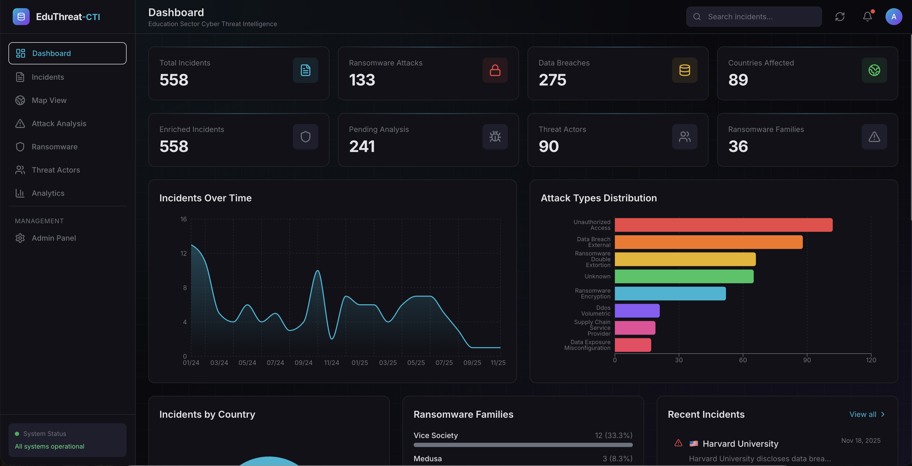

# EduThreat-CTI Dashboard

[](CHANGELOG.md)
[](https://nextjs.org/)
[](https://www.typescriptlang.org/)
[](https://tailwindcss.com/)
[](LICENSE)

**Professional Cyber Threat Intelligence Dashboard for the Education Sector**

A modern, responsive web dashboard for visualizing and analyzing cyber incidents targeting educational institutions worldwide. Built with Next.js 14, TypeScript, and Tailwind CSS.

> **Latest Release (v1.1.0)**: Country normalization with full names and flag emojis, CTI report downloads, enhanced admin panel, and improved incident detail pages for security researchers. See [CHANGELOG.md](CHANGELOG.md) for details.



## 🎯 Features

### Interactive Dashboard
- **Real-time Statistics**: Total incidents, ransomware attacks, data breaches, and countries affected
- **Time Series Charts**: Incident trends over time with area charts
- **Attack Distribution**: Horizontal bar charts showing attack type breakdown
- **Geographic Analysis**: Pie charts and maps showing incident distribution by country
- **Ransomware Tracking**: Progress bars showing ransomware family activity
- **Recent Activity Feed**: Live feed of latest incidents

### Incidents Management
- **Searchable List**: Full-text search across incidents
- **Advanced Filtering**: Filter by country, attack type, ransomware family, threat actor, year
- **Sortable Columns**: Sort by date, name, country
- **Pagination**: Efficient browsing of large datasets
- **Detail Views**: Comprehensive incident details with all enrichment data

### Detailed Incident Views
- **Timeline Visualization**: Chronological event reconstruction
- **MITRE ATT&CK Mapping**: Technique identification and tactic mapping
- **Impact Metrics**: Data, user, system, financial, regulatory impact
- **Attack Dynamics**: Kill chain analysis, ransomware details
- **Source Attribution**: Multi-source tracking and provenance
- **CTI Report Download**: Comprehensive Markdown reports for researchers and analysts
- **Country Normalization**: Full country names with ISO codes and flag emojis

### Analytics Pages
- **Attack Analysis**: Breakdown by attack category and vector
- **Ransomware Tracking**: Family-specific statistics and trends
- **Threat Actors**: Actor profiles with activity summaries
- **Geographic View**: Regional incident distribution with full country names and flags

### Admin Panel
- **Database Management**: Export full database or CSV files
- **Scheduler Controls**: Trigger RSS, weekly, and enrichment jobs
- **Data Maintenance**: Normalize countries, fix incident dates
- **CSV Export**: Separate exports for enriched and full datasets

## 🚀 Getting Started

### Prerequisites
- Node.js 18+ 
- npm or yarn
- EduThreat-CTI API server running (see below)

### Installation

```bash
# Clone the repository
git clone https://github.com/sagarkishore-7/EduThreat-CTI-Dashboard.git
cd EduThreat-CTI-Dashboard

# Install dependencies
npm install

# Configure environment
cp .env.example .env.local
# Edit .env.local with your API URL

# Start development server
npm run dev
```

### Environment Variables

Create a `.env.local` file:

```env
# API URL (EduThreat-CTI API server)
NEXT_PUBLIC_API_URL=http://localhost:8000

# Site metadata
NEXT_PUBLIC_SITE_NAME=EduThreat-CTI
NEXT_PUBLIC_SITE_DESCRIPTION=Cyber Threat Intelligence for Education Sector
```

### Running the API Server

The dashboard requires the EduThreat-CTI API server. Start it from the main project:

```bash
# In the EduThreat-CTI directory
cd ../EduThreat-CTI

# Install API dependencies
pip install fastapi uvicorn

# Start the API server
uvicorn src.edu_cti.api.main:app --host 0.0.0.0 --port 8000
```

## 🏗️ Architecture

```
EduThreat-CTI-Dashboard/
├── app/                      # Next.js App Router
│   ├── page.tsx              # Dashboard home
│   ├── incidents/            # Incidents list & detail
│   │   ├── page.tsx
│   │   └── [id]/page.tsx
│   ├── analytics/page.tsx    # Analytics dashboard
│   ├── attacks/page.tsx      # Attack analysis
│   ├── ransomware/page.tsx   # Ransomware tracking
│   ├── threat-actors/page.tsx # Threat actor profiles
│   └── map/page.tsx          # Geographic view
├── components/               # React components
│   ├── charts/               # Recharts visualizations
│   ├── Sidebar.tsx           # Navigation sidebar
│   ├── Header.tsx            # Top header
│   ├── StatCard.tsx          # Statistics cards
│   └── RecentIncidentsList.tsx
├── lib/                      # Utilities
│   ├── api.ts                # API client
│   └── utils.ts              # Helper functions
└── public/                   # Static assets
```

## 🔗 API Integration

The dashboard connects to the EduThreat-CTI REST API:

| Endpoint | Description |
|----------|-------------|
| `GET /api/dashboard` | Complete dashboard data |
| `GET /api/stats` | Summary statistics |
| `GET /api/incidents` | Paginated incident list |
| `GET /api/incidents/{id}` | Incident details |
| `GET /api/filters` | Available filter options |
| `GET /api/analytics/countries` | Country breakdown |
| `GET /api/analytics/attack-types` | Attack type breakdown |
| `GET /api/analytics/ransomware` | Ransomware statistics |
| `GET /api/analytics/threat-actors` | Threat actor data |
| `GET /api/incidents/{id}/report` | Download CTI report (Markdown) |
| `POST /api/admin/*` | Admin endpoints (authentication required) |
| `POST /api/admin/export/*` | Database and CSV export |
| `POST /api/admin/scheduler/trigger/*` | Trigger ingestion/enrichment jobs |
| `POST /api/admin/normalize-countries` | Normalize country data |

## 🎨 Design System

### Color Palette (Dark Theme)
- **Background**: `#0a0a0f` - Deep dark for reduced eye strain
- **Card**: `#111118` - Elevated surfaces
- **Primary**: `#06b6d4` - Cyan accent for CTI aesthetic
- **Accent**: `#8b5cf6` - Purple for highlights
- **Destructive**: `#ef4444` - Red for alerts and ransomware

### Typography
- **Sans**: Geist Sans - Modern, readable
- **Mono**: Geist Mono - Code and IDs

### Components
- Stat cards with glow effects
- Interactive chart tooltips
- Animated transitions
- Responsive grid layouts

## 📚 Documentation

- **[CHANGELOG.md](CHANGELOG.md)**: Detailed version history and changes
- **[VERSION_HISTORY.md](VERSION_HISTORY.md)**: Quick reference version summary
- **[Main Project README](../EduThreat-CTI/README.md)**: Complete project documentation

## 📦 Production Deployment

### Production API (Railway)

The API is deployed at:
```
https://eduthreat-cti-production.up.railway.app
```

### Vercel Deployment

1. **Import Repository**
   - Go to [Vercel](https://vercel.com/new)
   - Import from GitHub: `sagarkishore-7/EduThreat-CTI-Dashboard`

2. **Configure Environment Variables**
   Add this environment variable in Vercel project settings:
   ```
   NEXT_PUBLIC_API_URL=https://eduthreat-cti-production.up.railway.app
   ```

3. **Deploy**
   - Vercel will auto-deploy on push to `main`

### Local Build

```bash
# Build for production
npm run build

# Start production server
npm start
```

### Docker

```dockerfile
FROM node:18-alpine AS builder
WORKDIR /app
COPY package*.json ./
RUN npm ci
COPY . .
RUN npm run build

FROM node:18-alpine AS runner
WORKDIR /app
ENV NODE_ENV=production
COPY --from=builder /app/.next/standalone ./
COPY --from=builder /app/.next/static ./.next/static
EXPOSE 3000
CMD ["node", "server.js"]
```

## 🔒 Security Considerations

- CORS is configured to allow frontend access
- No authentication required for read-only dashboard
- API rate limiting recommended for production
- Consider adding authentication for sensitive data

## 📄 License

MIT License - see [LICENSE](LICENSE)

## 🤝 Contributing

Contributions welcome! Please see [CONTRIBUTING.md](../EduThreat-CTI/CONTRIBUTING.md) in the main project.

## 📬 Contact

For questions or feedback, open an issue on GitHub.

---

**Part of the [EduThreat-CTI](https://github.com/sagarkishore-7/EduThreat-CTI) project** - Making education sector threat intelligence transparent and accessible.

