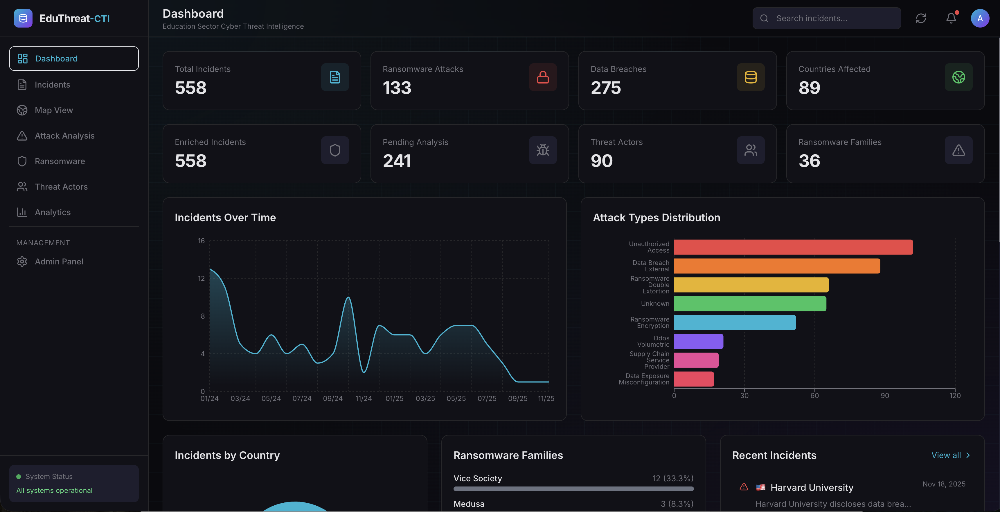

# EduThreat-CTI Dashboard

[](CHANGELOG.md)
[](https://nextjs.org/)
[](https://www.typescriptlang.org/)
[](https://tailwindcss.com/)
[](LICENSE)

**A serious-analyst Cyber Threat Intelligence platform UI for the education sector.**

EduThreat-CTI is a real-time CTI dashboard that visualizes cyber incidents targeting
universities, schools, and other education institutions worldwide. It is the
front end for the [EduThreat-CTI](https://github.com/sagarkishore-7/EduThreat-CTI)
v2 Postgres-backed intelligence pipeline and reads exclusively from its
`/api/v2` surface.

> **v3.0.0 — "Operations Room" redesign.** The dashboard was rebuilt around a
> stream-first, panel-rich CTI aesthetic inspired by platforms like OpenCTI:
> a live operations strip, KPI tiles with inline trend sparklines, a world
> threat-telemetry map with attack arcs, a live event stream, a MITRE ATT&CK
> heat strip, and a full TLP 2.0 marking system. Five new pages were added
> (MITRE ATT&CK, Intel Feeds, Reports, Investigations, Components). See
> [CHANGELOG.md](CHANGELOG.md).



---

## ✨ Highlights

- **Stream-first dashboard** — live ops strip, four KPI tiles each with an inline
  sparkline trend, a world threat-telemetry map with animated attack arcs, a
  live event stream, and a 14-tactic MITRE ATT&CK heat strip.
- **TLP 2.0 markings everywhere** — `TLP:RED / AMBER / AMBER+STRICT / GREEN / CLEAR`
  derived per incident and shown on the dashboard feed, incident list, incident
  detail, and reports.
- **Real data, real endpoints** — every panel reads from the live v2 API; no mock
  data. Two backend endpoints were added to power the redesign
  (`/api/v2/analytics/kpi-trends`, `/api/v2/analytics/feeds`).
- **13 pages** across Overview, Intelligence, Knowledge, and System tracks.
- **A small, reusable design system** (`components/ui/`) built on a shared token
  set in `app/globals.css`.

---

## 🗺️ Pages

| Route | Page | What it shows |
|-------|------|---------------|
| `/` | **Dashboard** | Ops strip · KPI tiles w/ sparklines · world telemetry map · live event stream · MITRE strip · incident trend · top actors · attack mix |
| `/incidents` | **Incidents** | Faceted incident workspace; table with severity + TLP columns, search, filters, pagination |
| `/incidents/[id]` | **Incident Detail** | Case file: TLP marker, kill chain, timeline, MITRE TTPs, impact, sources |
| `/investigations` | **Investigations** | Force-directed actor → geography → ransomware-family knowledge graph + inspector |
| `/map` | **Geo Map** | Geographic pressure map (choropleth / dots / arcs), regional clusters, watchlist |
| `/attacks` | **Attack Intel** | Tradecraft & intrusion patterns, attack-type distribution, observed tactics |
| `/threat-actors` | **Threat Actors** | Attribution watchlist, lead profile, per-actor targeting & family overlap |
| `/ransomware` | **Ransomware** | Family prevalence, extortion pressure, geographic targeting, live feed |
| `/mitre` | **MITRE ATT&CK** | Coverage KPIs, observed-tactic heat strip, ATT&CK technique matrix, top techniques |
| `/analytics` | **Analytics** | Victimology, tradecraft, attribution, exposure, and coverage workbook |
| `/reports` | **Reports** | Report templates, incident bulletins (w/ export), sector advisories, actor profiles |
| `/feeds` | **Intel Feeds** | Per-source ingestion health, volume by source group, enrichment pipeline chain |
| `/components` | **Components** | Living design-system reference (colors, TLP, severity, pills, KPI tiles, etc.) |
| `/admin`, `/admin/review` | **Admin** | Runtime health, collection plans, manual review (token-gated via the avatar menu) |

---

## 🚀 Getting Started

### Prerequisites
- Node.js 18+
- npm
- A running EduThreat-CTI v2 API (see below)

### Install & run

```bash
git clone https://github.com/sagarkishore-7/EduThreat-CTI-Dashboard.git
cd EduThreat-CTI-Dashboard

npm install
cp .env.example .env.local        # then edit NEXT_PUBLIC_API_URL
npm run dev                        # http://localhost:3000
```

### Environment variables

`.env.local`:

```env
# Base URL of the EduThreat-CTI v2 API
NEXT_PUBLIC_API_URL=http://localhost:8000

# Site metadata
NEXT_PUBLIC_SITE_NAME=EduThreat-CTI
NEXT_PUBLIC_SITE_DESCRIPTION=Cyber Threat Intelligence for Education Sector
```

### Running the v2 API locally

The dashboard talks to the **v2 Postgres-backed API** in the backend repo:

```bash
cd ../EduThreat-CTI
# EDU_CTI_V2_DATABASE_URL must point at the v2 Postgres database
python -m src.edu_cti_v2.api_server --host 127.0.0.1 --port 8000
# docs: http://localhost:8000/docs
```

---

## 🏗️ Architecture

```
EduThreat-CTI-Dashboard/
├── app/                        # Next.js App Router (one folder per route)
│   ├── page.tsx                # Dashboard
│   ├── incidents/              # List + [id] detail
│   ├── investigations/         # Knowledge graph
│   ├── map/                    # Geo map
│   ├── attacks/                # Attack intel
│   ├── threat-actors/          # Attribution watchlist
│   ├── ransomware/             # Ransomware tracking
│   ├── mitre/                  # MITRE ATT&CK
│   ├── analytics/              # Analyst workbook
│   ├── reports/                # Intelligence products
│   ├── feeds/                  # Source ingestion health
│   ├── components/             # Design-system reference
│   ├── admin/                  # Operations console (token-gated)
│   └── globals.css             # Design tokens + component classes
├── components/
│   ├── ui/                     # Reusable design-system primitives
│   │   ├── OpsStrip.tsx        # Live ops strip (stats + TLP + range + clock)
│   │   ├── KpiTile.tsx         # KPI tile with inline Sparkline + delta
│   │   ├── Sparkline.tsx       # Area+line micro-chart
│   │   ├── TrendChart.tsx      # Brand-styled incident trend (recharts)
│   │   ├── MitreStrip.tsx      # 14-tactic ATT&CK heat strip
│   │   ├── LiveFeed.tsx        # Live event stream (severity + TLP rows)
│   │   ├── BarList.tsx         # Ranked horizontal bar list
│   │   ├── Card.tsx            # Card / CardHead / CardBody
│   │   ├── TlpBadge.tsx        # TLP 2.0 marker + deriveTlp() helper
│   │   └── SeverityPill.tsx    # Severity pill + classifiers
│   ├── charts/                 # Recharts / Nivo visualizations
│   ├── Sidebar.tsx             # Grouped nav + live status footer
│   ├── Header.tsx              # Breadcrumb + ⌘K search + admin auth
│   └── ...
└── lib/
    ├── api.ts                  # Typed v2 API client
    └── utils.ts               # Formatting, country/flag helpers
```

---

## 🔗 API Integration (v2)

The dashboard reads exclusively from the `/api/v2` surface:

| Endpoint | Used by |
|----------|---------|
| `GET /api/v2/dashboard` | Dashboard, Reports |
| `GET /api/v2/stats` | Sidebar badges, Map |
| `GET /api/v2/analytics/kpi-trends` | Dashboard KPI sparklines **(added for v3)** |
| `GET /api/v2/analytics/feeds` | Intel Feeds **(added for v3)** |
| `GET /api/v2/analytics/mitre` | Dashboard MITRE strip, MITRE page |
| `GET /api/v2/analytics/intelligence` | Dashboard, Analytics |
| `GET /api/v2/analytics/threat-actors` | Threat Actors, Investigations |
| `GET /api/v2/analytics/countries` | Geo Map |
| `GET /api/v2/analytics/attack-types` / `ransomware` / `trend` | Attack Intel, Ransomware |
| `GET /api/v2/incidents` / `incidents/{id}` | Incidents, Detail |
| `GET /api/v2/incidents/{id}/report` | Reports export |
| `GET /api/v2/filters` | Incidents facets |
| `/api/admin/v2/*` | Admin console (token-gated) |

---

## 🎨 Design System

Tokens and component classes live in `app/globals.css`; React primitives live in
`components/ui/`. The `/components` route renders a living reference.

### Palette
- **Surfaces** — near-black ladder: `--ink #08090f` → `--void #0a0c14` → `--surface #10131c` → `--elevated #161a26`
- **Brand** — signal mint `#00d8b4`
- **Relations** — pulse indigo `#818cf8`
- **Severity** — threat `#ff4757` · warn `#ff8c42` · watch `#ffd93d` · info `#4dbcff` · clear `#4ade80`
- **TLP 2.0** — red `#ff3838` · amber `#ff8c00` · amber+strict `#ff6600` · green `#33cc33` · clear `#ffffff`

### Typography
- **Sans** — Inter (UI)
- **Mono** — JetBrains Mono (all numerics, IDs, timestamps; tabular figures)

---

## 📦 Production Deployment

### Production API (Railway)
The supported production backend is the `v2-api` Railway service, e.g.
`https://v2-api-production-e3d1.up.railway.app`.

### Vercel
1. Import `sagarkishore-7/EduThreat-CTI-Dashboard` at [vercel.com/new](https://vercel.com/new).
2. Set `NEXT_PUBLIC_API_URL` to the v2-api Railway domain.
3. Vercel auto-deploys on push to `main`.

### Local build

```bash
npm run build
npm start
```

---

## 📚 Documentation

- **[CHANGELOG.md](CHANGELOG.md)** — detailed version history
- **[VERSION_HISTORY.md](VERSION_HISTORY.md)** — quick version summary
- **[Backend README](../EduThreat-CTI/README.md)** — pipeline & API documentation

## 📄 License

MIT — see [LICENSE](LICENSE).

---

**Part of the [EduThreat-CTI](https://github.com/sagarkishore-7/EduThreat-CTI) project** — making education-sector threat intelligence transparent and accessible.
